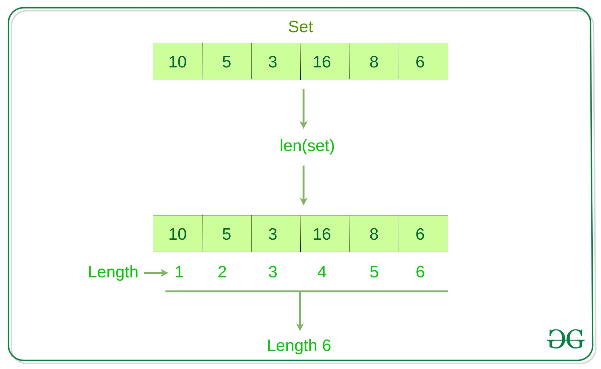

# Sets

## What is the purpose of the data structure?
When we reflect on the evolution of computers, we often think about their lightning fast speeds for complex tasks. Certainly, processing power has greatly improved, but often incredibly fast access to data comes from a programmers savy to recognize when the appropriate data structure should be used. When applicable, **sets** are an incredibly fast means of accessing, updating, and storing information.

## Speed - Why are they so fast?
Sets utilize a method of storing data in memory referred to as hashing. Simply put, hashing turns data into a number which will represent not only the data value, but also its point in memory. Being able to cycle through data, by anticipating where the data is stored allows for retrieval of O(1) performance which directly overpowers the speeds of other data structures such as lists; lists are associated with O(n) performance because cycling through ever value until the needed value is found.

## Compare and Contrast

Many compare lists and sets. Despite being similar, they have two distinct differences:
1. Sets do not allow for duplicate values
2. The set does not keep values in order

## Properties of Sets
To begin using sets and to begin taking advantage of its quick speed we need to first learn how to interface with sets:
|  Python Code   |      Description      |
| :-----: | :------------: |
|  my_set = set()  |     Create an empty set     |
|  my_set = {?, ?, ?}  |     Initializes set with values in curly braces    |
|  my_set.add(value)  |     Adds "value" to the set     |
| my_set.remove(value) | Removes the "value" from the set |
|  if value in my_set:   |    Returns a boolean which answers: is "value" in my_set?     |
|  length = len(my_set)  |     Outputs the number of values in the set     |


<sub>Figure 1 - How `len()` is represented in memory^^</ub>


## So why sets?
They are fast! With a performance of O(1), `sets` are seemingly unbeatable. Additionally, it automatically condenses repeated values (no errors are thrown when you try inserting a value that already exists). Since sets store unique values, lets consider the following situation:

You are the organizer of a large event and by association, you also manage the event's raffle. Each guest at the event receives a raffle ticket. All the raffle ticket's unique IDs are stored in the set, `ticketNums`. We will `import Random` to help us pick a random ticket number, and then use properties of sets to confirm that the raffle number exists in the set. [**-Set Syntax-**](#properties-of-sets) 

***Note - Common mistakes with sets will be emphasized in the comments of the python code segment***


```python
import random

#We initialize with the ticket numbers that were pre-registered
ticketNums = {9267, 6092, 8681, 5455, 3302, 6461}

#We add ticket numbers for those that showed up late
ticketNums.add(7318)
ticketNums.add(9181)
ticketNums.add(4620)

#One of the pre-registered people is going home before the raffle
ticketNums.remove(8681)

#It's time for the raffle! Pick the winning number 
#Pick a random position based on the length **Note the use of len()**
winningTicketIndex = random.randrange(len(ticketNums))

#Common Mistake: To highlight the fact that sets do not order its values we must first convert the set to a list! 
winningTicketValue = list(ticketNums)[winningTicketIndex]

#Confirm that the number exists (redundancy - Not necessary)
#** Note the use of "if value in set" (returns boolean)
if winningTicketValue in ticketNums:
    print(winningTicketValue)
else:
    #Handle exceptions
    raise Exception("Sorry, not valid number")

## OUTPUT: any random number from the set of raffle numbers
## The output will not 8681 because it was removed from the set.
```

## Test Your Understanding
Implement the following code based on the given scenario:

Imagine that you manage a paid parking valet in a parking garage. Your job is to track which cars are currently parked in your facility. Since all cars have a unique license plate number, a set will work properly to store the needed values.

Create a `ManageCar` class with the following functions:

```python
def parkCar(licensePlate):
    # Parameters: License Plate
    # Call this function when a person drops off their car at the valet
    # This function should *ADD* the car's license plate to the set

def returnCar(licensePlate):
    # Parameters: License Plate
    # Call this function when a person wants their car back from the valet
    # This function should *REMOVE* the car's license plate to the set

def confirmCar(licensePlate):
    #While the car is parked, customers can come ensure that their car is still under your supervision

def outputInventory():
    #Print the set to screen
```

Use this code to test 
```python
#There is an event going on, and many people are coming to have their cars parked
parkCar("AU421Y") # Car Successfully parked
parkCar("5DJ1368") # Car Successfully parked
parkCar("FAC080") # Car Successfully parked
parkCar("GZT6888") # Car Successfully parked
parkCar("7217TA") # Car Successfully parked
parkCar("LMM2613") # Car Successfully parked
parkCar("ASM4000") # Car Successfully parked
parkCar("16687") # Car Successfully parked

#The event is starting to end and someone is going home
returnCar("FAC080") # Car Successfully Returned to Customer

#Someone wants to confirm that their car is still there:
confirmCar("GZT6888") # Car is safely parked!

#Show which cars are leftover
outputInventory() # Here is a list of the parked cars: {'5DJ1368', 'LMM2613', 'GZT6888', 'ASM4000', '7217TA', '16687', 'AU421Y'}
```

You can check your code with the solution here: [Solution](valet.py)

[Back to Welcome Page](0-welcome.md)