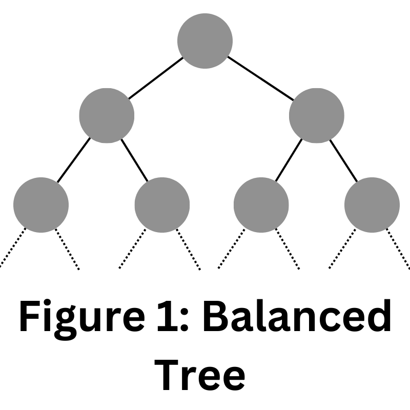
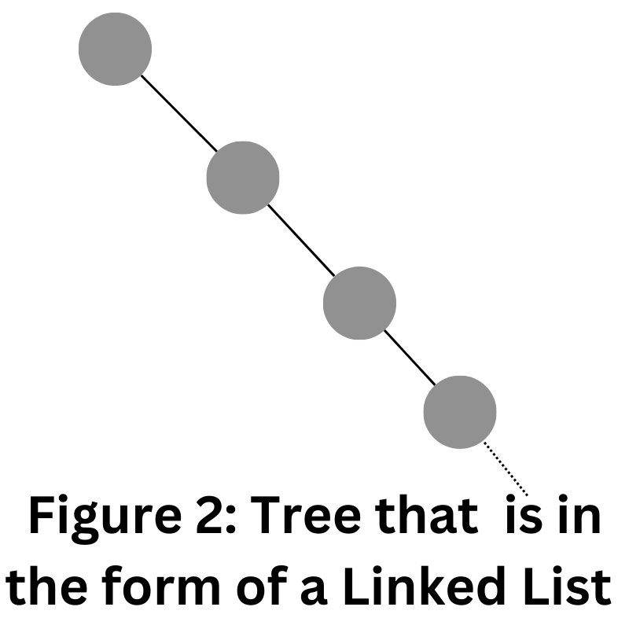

# Trees

Similar to linked lists, trees are nodes that are linked together by pointers. The principal differences are best shown in a visual representation. As you look at **figure 1** and **figure 2**, focus on the following:
- Relationship between the nodes
- What are the pointers pointing to?
- If each node holds data values, how might a tree be represented as a linear linked list?




***
**Note: dotted lines represent continuation of pattern**
***

## Take Aways
Being able to visualize the relationships of nodes is the secret (not actually a secret) to successfully solving problems related to binary search trees. From those images, you should begin to understand that a tree can double as a linked list, but a linked list would not traditionally represent a tree. Knowing that nodes can be assembled in many different forms, we will continue forward focusing on the following trees:
1. Binary trees
2. Binary search trees
3. Balanced binary search trees.

To understand these trees it helps to have a useful vocabulary to discuss the various elements.

## Useful Definitions


**NOTE: Although the image provides deeper visualization, the cooresponding key term table will focus on a subset of all of the possible terms available**
| Key Term      | Definition                                            | 
| ------------- | ------------------------------------------------- | 
| Node      | A location in memory that stores values (generally connected to the rest of a tree)| 
| Parent | The head node of either a tree or subtree. | 
| Child  | The node immediate following a parent                             |
| Sub Tree  | A subset of the larger tree                             |
| Leaf Node  | A Node without children nodes                             |

## Balanced Trees

A balanced tree is a tree where each subtree's height is equal on either side of the tree. One way of grasping this concept is to invision that each node is a decision point. Let's suppose that a number data value is added to a binary tree. The tree will start from the head of the tree, and determine if the value that it is adding is either greater than the current node or less than the current node. If it is bigger, then it will progress down the right side of the tree if it is less it will progress down the left side of the tree. Eventually the computer will reach a leaf node, and have to make the final decision of whether the value is greater than or less than the leaf node; at that point, the value would be posited at that final position. 

## Trees and Recursion

As described in the previous section, there is a series of decisions that need to be made by the computer. In reality, the way this process is handled is through recursion. Recursion is when a function calls itself and only exists when a base condition is met. One such example is when it reaches the end of a tree. When it reaches the end of the tree, the function will return a value, and that value will continue to be passed through back up the call stack. This is the systematic way of solving a problem that would otherwise require a lot of individual hardcoding. 

Thus, as the depth of trees expands to reach incredibly large data sets, it would be tedious to insert values into trees. So instead, we use functions to accomplish this. Here is example of such function:

```Python
def _insert(self, data, node):
        """
        This function will look for a place to insert a node
        with 'data' inside of it.  The current sub-tree is
        represented by 'node'.  This function is intended to be
        called the first time by the insert function.
        """
        if data < node.data:
            # The data belongs on the left side.
            if node.left is None:
                # We found an empty spot
                node.left = BST.Node(data)
            else:
                # Need to keep looking.  Call _insert
                # recursively on the left sub-tree.
                self._insert(data, node.left)
        elif data > node.data:
            # The data belongs on the right side.
            if node.right is None:
                # We found an empty spot
                node.right = BST.Node(data)
            else:
                # Need to keep looking.  Call _insert
                # recursively on the right sub-tree.
                self._insert(data, node.right)
        else: 
            # UNIQUE VALUES: if the data is equal to the node.data then don't do anything 
            pass
```

Similarly, this is how we would traverse through a tree using that same recursive principle:

```python
    def _traverse_forward(self, node):
        """
        Does a forward traversal (in-order traversal) through the 
        BST.  If the node that we are given (which is the current
        sub-tree) exists, then we will keep traversing on the left
        side (thus getting the smaller numbers first), then we will 
        provide the data in the current node, and finally we will 
        traverse on the right side (thus getting the larger numbers last).

        The use of the 'yield' will allow this function to support loops
        like:

        for value in my_bst:
            print(value)

        The keyword 'yield' will return the value for the 'for' loop to
	    use.  When the 'for' loop wants to get the next value, the code in
	    this function will start back up where the last 'yield' returned a 
	    value.  The keyword 'yield from' is used when our generator function
        needs to call another function for which a `yield` will be called.  
        In other words, the `yield` is delegated by the generator function
        to another function.

        This function is intended to be called the first time by 
        the __iter__ function.
        """
        if node is not None:
            yield from self._traverse_forward(node.left)
            yield node.data
            yield from self._traverse_forward(node.right)
```

Binary search trees are made possible in the real world because of recursion.

## Advantages

Performance! Compared to other data structures, binary search trees are an incredibly fast means of locating, adding, and removing data. 

When accessing every value is not necessary, performance follows a O(log n) performance. This is far faster than other data structures which generally have O(n) performance.

## Try it yourself

When people are first working with recursion and trees (decision) trees it is often the case that they do not consider all of decisions in the call stack. To prevent this common error is is recommended to trace through your code in a debugger, or on paper if needed.

Using recursion (patterned after the `_insert` function) create a `contains` function that identifies if a value exists in the tree.

You can check your code with the solution here: [Solution](contains.py)

[Back to Welcome Page](0-welcome.md)